# Gesamtprozess-Flowchart

> Alle 11 Phasen des After-Sales-Prozesses als visuelles Flussdiagramm mit Verantwortlichkeiten.
> Basierend auf: [After-Sales-Prozess.md](../After-Sales-Prozess.md)

---

## Diagramm

```mermaid
flowchart LR

    subgraph PREP["Vorbereitung"]
        P0["Phase 0\nSystem-Setup\n(vor erstem Kunden)"]
    end

    subgraph ONBOARDING["Onboarding (Tag 0-14)"]
        P1["Phase 1\nVertragsabschluss\n(Tag 0)"]
        P2["Phase 2\nWelcome Package\n(Tag 1-3)"]
        P3["Phase 3\nDiscovery & Setup\n(Tag 1-7)"]
    end

    subgraph STRATEGIE["Strategie (Tag 7-21)"]
        P4["Phase 4\nStrategie & Kickoff\n(Tag 7-14)"]
        P5["Phase 5\nErster Quick Win\n(Tag 7-21)"]
    end

    subgraph LAUFEND["Laufend (ab Tag 14)"]
        P6["Phase 6\nKommunikation\n(laufend)"]
        P7["Phase 7\nWow-Momente\n(laufend)"]
        P8["Phase 8\nReview & Testimonials"]
    end

    subgraph WACHSTUM["Wachstum & Retention"]
        P9["Phase 9\nReferral-System"]
        P10["Phase 10\nUpselling &\nCross-Selling"]
        P11["Phase 11\nRetention &\nAnti-Churn"]
    end

    %% Hauptfluss
    P0 --> P1
    P1 --> P2
    P1 --> P3
    P2 --> P4
    P3 --> P4
    P4 --> P5
    P5 --> P6
    P6 --> P7
    P7 --> P8
    P8 --> P9
    P8 --> P10
    P9 --> P11
    P10 --> P11

    %% Feedback-Loop
    P11 -.->|"Retention-Loop:\nneuen Wert schaffen"| P7

    %% Styling nach Verantwortlichkeit
    classDef gf fill:#4a90d9,stroke:#2c5aa0,color:#fff
    classDef am fill:#50c878,stroke:#2e8b57,color:#fff
    classDef ops fill:#f5a623,stroke:#d4841f,color:#fff
    classDef strategy fill:#9b59b6,stroke:#7d3c98,color:#fff
    classDef team fill:#e74c3c,stroke:#c0392b,color:#fff

    class P0 ops
    class P1 gf
    class P2 ops
    class P3 am
    class P4 strategy
    class P5 am
    class P6 am
    class P7 team
    class P8 am
    class P9 am
    class P10 am
    class P11 team
```

---

## Legende

| Farbe | Verantwortlichkeit | Phasen |
|---|---|---|
| Blau | Geschaeftsfuehrer (GF) | Phase 1 |
| Gruen | Account Manager (AM) | Phase 3, 5, 6, 8, 9, 10 |
| Orange | Operations | Phase 0, 2 |
| Lila | Strategy Team | Phase 4 |
| Rot | Gesamtes Team | Phase 7, 11 |

### Ablauf-Erklaerung

- **Vorbereitung:** Systeme und Templates werden einmalig vor dem ersten Kunden eingerichtet
- **Onboarding:** Phase 1-3 laufen teilweise parallel (Welcome Package + Discovery gleichzeitig)
- **Strategie:** Audit und Quick Win starten parallel, muenden im Kickoff
- **Laufend:** Kommunikation, Wow-Momente und Reviews bilden einen kontinuierlichen Kreislauf
- **Wachstum:** Referrals und Upselling fuettern die Retention, die wiederum neue Wow-Momente ausloest (Feedback-Loop)

---

## Verknuepfte Dokumente

- [After-Sales-Prozess.md](../After-Sales-Prozess.md) -- Hauptdokument mit allen 11 Phasen im Detail
- [checklisten/00-setup-checkliste.md](../checklisten/00-setup-checkliste.md) -- Phase 0
- [vorlagen/kickoff-agenda.md](../vorlagen/kickoff-agenda.md) -- Phase 4
- [vorlagen/client-health-scorecard.md](../vorlagen/client-health-scorecard.md) -- Phase 11
