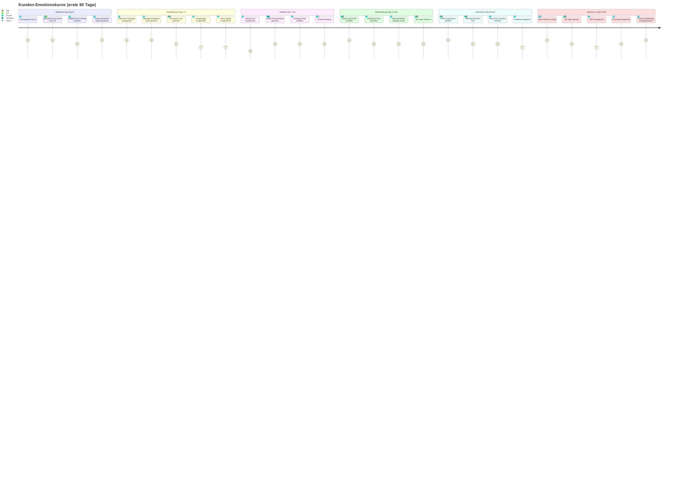

# Customer Journey Map

> Emotionskurve und Touchpoints der ersten 90 Tage aus Kundenperspektive.
> Basierend auf: [After-Sales-Prozess.md](../After-Sales-Prozess.md) (Teil 5: Komplette Timeline)

---

## Diagramm

---

## Touchpoint-Detail-Tabelle

| Tag | Touchpoint | Kanal | Verantwortlich | Emotionswert |
|---|---|---|---|---|
| 0 | Vertragsabschluss | Persoenlich/Video | GF | 5 -- Euphorie |
| 0 | Glueckwunsch-Anruf | Telefon/Video | Geschaeftsfuehrer | 5 -- Begeisterung |
| 0 | Willkommens-Email | Email | Account Manager | 4 -- Zuversicht |
| 0 | Personalisiertes Danke-Video | Video (Loom) | GF/AM | 5 -- Ueberraschung |
| 1-3 | Welcome Package auspacken | Physisch (Post) | Operations | 5 -- Wow-Effekt |
| 0-1 | Handgeschriebene Karte | Physisch (Post) | AM/GF | 5 -- Wertschaetzung |
| 2-3 | Discovery Call | Video-Call | Account Manager | 4 -- Vertrauen |
| 3-5 | Fragebogen ausfuellen | Email/Portal | Kunde (selbst) | 3 -- Arbeit |
| 3-5 | Tool-Zugriffe nutzen | Digital | Operations | 3 -- Eingewoehnung |
| 7-10 | Warten auf erste Ergebnisse | -- | -- | 2 -- Zweifel (Buyer's Remorse) |
| 7-10 | Audit-Praesentation | Video-Call | Strategy Team | 4 -- Erleichterung |
| 10-14 | Strategie-Plan erhalten | Email/Portal | Strategy Team | 4 -- Orientierung |
| 14 | Kickoff-Meeting | Video-Call | Gesamtes Team | 4 -- Aufbruch |
| 7-21 | **Erster Quick Win** | Email/Call | Account Manager | **5 -- Bestaetigung** |
| 14 | Dashboard live sehen | Digital | Analytics | 4 -- Transparenz |
| 14+ | Woechentliche Status-Updates | Email | Account Manager | 4 -- Sicherheit |
| 30 | 30-Tage Check-in | Call | Account Manager | 4 -- Reflexion |
| 21-28 | Erste Ergebnisse gefeiert | Email/Call | Account Manager | 5 -- Stolz |
| ~30 | Strategie-Review | Video-Call | Account Manager | 4 -- Klarheit |
| ~60 | Branchen-Insights | Email | Account Manager | 4 -- Mehrwert |
| ~60 | Feedback-Gespraech | Email/Call | Account Manager | 3 -- Ehrlichkeit |
| laufend | Popsicle Moment / Wow-Geste | Variiert | Gesamtes Team | 5 -- Ueberraschung |
| 90 | 90-Tage Review | Praesentation | Account Manager | 4 -- Bilanz |
| 90 | NPS-Umfrage | Email | Customer Success | 3 -- Pflicht |
| 90+ | Testimonial geben | Email/Video | Kunde | 4 -- Stolz |
| 90+ | Erste Empfehlung | Persoenlich | Kunde | 5 -- Advocacy |

---

## Legende

### Emotions-Skala

| Wert | Bedeutung | Psychologisches Prinzip |
|---|---|---|
| **5** | Begeistert / Wow | Peak-End Rule (Peak-Momente) |
| **4** | Positiv / zufrieden | Vertrauensaufbau |
| **3** | Neutral / sachlich | IKEA-Effekt (Eigenleistung) |
| **2** | Unsicher / zweifelnd | Buyer's Remorse |
| **1** | Frustriert / enttaeuscht | (sollte nie auftreten) |

### Kritische Uebergaenge

1. **Tag 0 → Tag 7:** Euphorie darf nicht einbrechen → Physische Touchpoints halten Emotionen hoch
2. **Tag 7-14:** Natuerlicher Zweifel-Phase → Audit und Quick Win muessen diese Luecke fuellen
3. **Tag 14 → Tag 30:** Quick Win ist der entscheidende Wendepunkt (Buyer's Remorse → Bestaetigung)
4. **Tag 60 → Tag 90:** Vom zufriedenen Kunden zum aktiven Fuersprecher → Wow-Momente und Ergebnisse

---

## Verknuepfte Dokumente

- [After-Sales-Prozess.md](../After-Sales-Prozess.md) -- Komplette Timeline (Teil 5)
- [diagramme/03-email-sequenz-timeline.md](03-email-sequenz-timeline.md) -- Gantt-Chart aller Touchpoints
- [email-templates/](../email-templates/) -- Alle 6 Email-Templates
