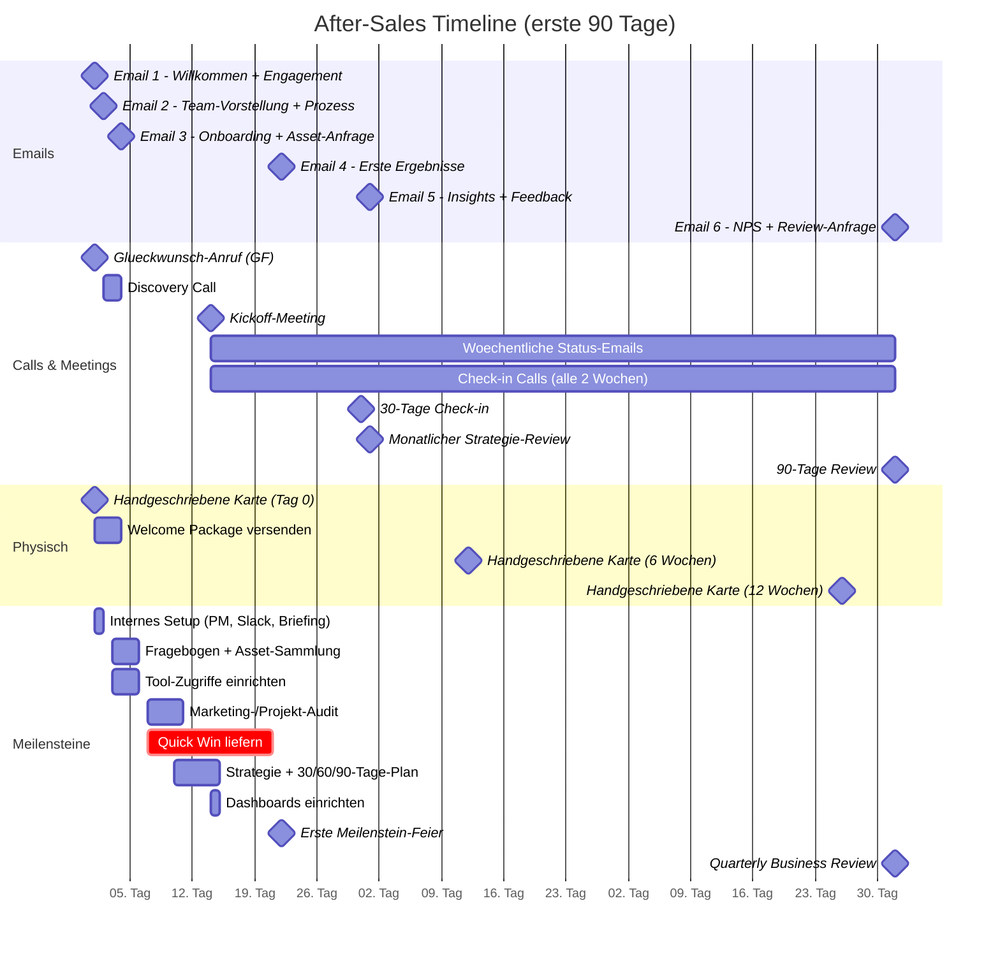

# Email-Sequenz & Touchpoint-Timeline (90 Tage)

> Alle Kommunikations-Touchpoints der ersten 90 Tage als Gantt-Diagramm.
> Basierend auf: [After-Sales-Prozess.md](../After-Sales-Prozess.md) (Teil 4 & 5)

**Hinweis:** Das Startdatum 2025-01-01 ist fiktiv und steht fuer "Tag 0 = Vertragsabschluss". Alle Zeitangaben sind relativ zum Vertragsabschluss zu lesen.

---

## Diagramm

---

## Legende

| Symbol | Bedeutung |
|---|---|
| Raute (Milestone) | Einmaliges Punkt-Event |
| Balken | Fortlaufende Aktivitaet mit Dauer |
| Roter Balken (crit) | Kritischer Meilenstein -- Quick Win |

### Sektionen erklaert

| Sektion | Inhalt |
|---|---|
| **Emails** | 6 automatisierte Emails der Post-Purchase-Sequenz |
| **Calls & Meetings** | Alle persoenlichen Touchpoints (Anrufe, Video-Calls, Reviews) |
| **Physisch** | Haptische Touchpoints (Karten, Welcome Package) |
| **Meilensteine** | Interne Arbeitspakete und Kunden-Erfolgsmomente |

### Wiederkehrende Aktivitaeten (ueber 90 Tage hinaus)

| Aktivitaet | Frequenz |
|---|---|
| Status-Email | Woechentlich |
| Check-in Call | Alle 2 Wochen |
| Strategie-Review | Monatlich |
| Handgeschriebene Karte | Alle 6 Wochen |
| Quarterly Business Review | Quartalsweise |
| NPS-Survey | Quartalsweise |
| Popsicle Moments | Laufend (ungeplant) |

---

## Verknuepfte Dokumente

- [email-templates/01-willkommens-email.md](../email-templates/01-willkommens-email.md) -- Email 1
- [email-templates/02-team-vorstellung.md](../email-templates/02-team-vorstellung.md) -- Email 2
- [email-templates/03-onboarding-checklist.md](../email-templates/03-onboarding-checklist.md) -- Email 3
- [email-templates/04-erste-ergebnisse.md](../email-templates/04-erste-ergebnisse.md) -- Email 4
- [email-templates/05-insights-feedback.md](../email-templates/05-insights-feedback.md) -- Email 5
- [email-templates/06-nps-review.md](../email-templates/06-nps-review.md) -- Email 6
- [vorlagen/kickoff-agenda.md](../vorlagen/kickoff-agenda.md) -- Kickoff-Meeting
