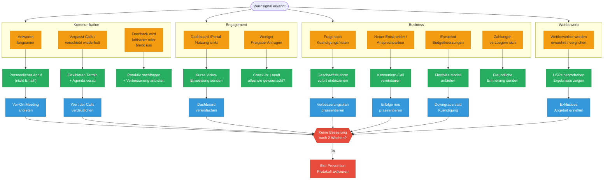
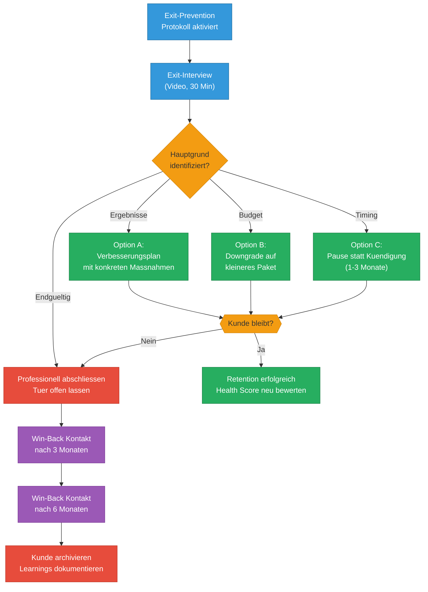

# Churn-Warning Entscheidungsbaum

> 10 Warnsignale mit Sofort-Massnahmen, Eskalationspfaden und Win-Back-Optionen.
> Basierend auf: [vorlagen/client-health-scorecard.md](../vorlagen/client-health-scorecard.md)

---

## Diagramm 1: Warnsignale und Sofort-Massnahmen

---

## Diagramm 2: Exit-Prevention und Win-Back

---

## Legende

### Farbkodierung Diagramm 1

| Farbe | Bedeutung |
|---|---|
| Orange | Warnsignal (10 Frueh-Indikatoren) |
| Gruen | Sofort-Massnahme (innerhalb 24h) |
| Blau | Follow-Up (innerhalb 1 Woche) |
| Rot | Eskalation (Exit-Prevention) |

### Farbkodierung Diagramm 2

| Farbe | Bedeutung |
|---|---|
| Blau | Prozess-Schritte |
| Orange | Entscheidungs-Punkte |
| Gruen | Optionen / Retention |
| Lila | Win-Back-Kontakte |
| Rot | Endgueltige Schritte |

### Warnsignal-Kategorien

| Kategorie | Signale | Schweregrad |
|---|---|---|
| **Kommunikation** | Langsame Antworten, verpasste Calls, fehlendes Feedback | Mittel-Hoch |
| **Engagement** | Sinkende Dashboard-Nutzung, weniger Freigaben | Mittel |
| **Business** | Kuendigungsfragen, neuer Entscheider, Budgetkuerzung, Zahlungsverzug | Hoch-Kritisch |
| **Wettbewerb** | Vergleiche mit Wettbewerbern | Hoch |

---

## Verknuepfte Dokumente

- [vorlagen/client-health-scorecard.md](../vorlagen/client-health-scorecard.md) -- Warnsignale-Checkliste und Exit-Prevention Protokoll
- [diagramme/06-health-scorecard-dashboard.md](06-health-scorecard-dashboard.md) -- Score-Zonen (ab wann wird eskaliert)
- [After-Sales-Prozess.md](../After-Sales-Prozess.md) -- Phase 11: Retention & Anti-Churn
