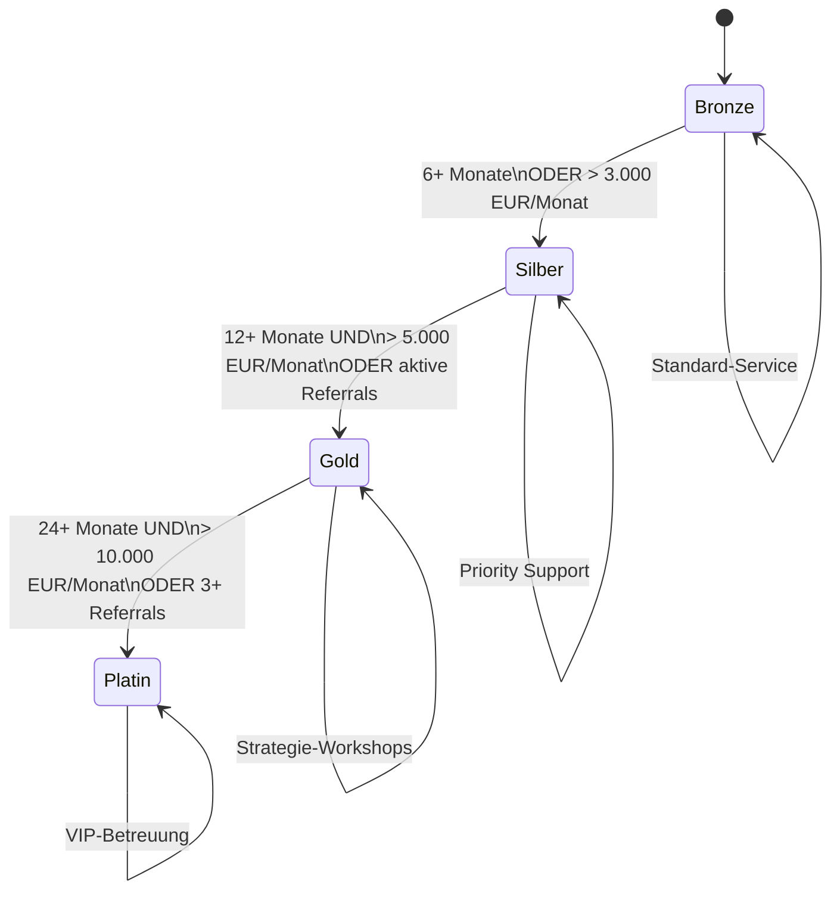

# Tier-Progression: Kunden-Stufensystem

> Status-basierte Retention von Bronze bis Platin mit Aufstiegskriterien und Vorteilen.
> Basierend auf: [vorlagen/client-health-scorecard.md](../vorlagen/client-health-scorecard.md)

---

## Diagramm 1: Stufen-Uebergaenge

---

## Diagramm 2: Vorteile pro Stufe

```mermaid
flowchart LR

    subgraph BRONZE["Bronze (Neukunde, 0-6 Monate)"]
        B1["Standard-Service"]
        B2["Regelmaessige Updates"]
        B3["Woechentliche Status-Email"]
        B4["Check-in Calls alle 2 Wochen"]
    end

    subgraph SILBER["Silber (6+ Mon. / > 3k EUR)"]
        S1["Priority Support"]
        S2["Monatlicher Branchen-Report"]
        S3["Alles aus Bronze"]
    end

    subgraph GOLD["Gold (12+ Mon. & > 5k EUR)"]
        G1["Quartalsweiser Strategie-Workshop"]
        G2["Beta-Zugang neue Services"]
        G3["Persoenliche Event-Einladungen"]
        G4["Alles aus Silber"]
    end

    subgraph PLATIN["Platin (24+ Mon. & > 10k EUR)"]
        P1["Dedizierter Senior AM"]
        P2["Jaehrlicher In-Person Strategy Day"]
        P3["VIP-Support (4h Antwortzeit)"]
        P4["Exklusive Branchenevents"]
        P5["Alles aus Gold"]
    end

    BRONZE --> SILBER --> GOLD --> PLATIN

    classDef bronze fill:#cd7f32,stroke:#8b5a2b,color:#fff
    classDef silber fill:#c0c0c0,stroke:#808080,color:#333
    classDef gold fill:#ffd700,stroke:#b8960f,color:#333
    classDef platin fill:#e5e4e2,stroke:#71706e,color:#333

    class B1,B2,B3,B4 bronze
    class S1,S2,S3 silber
    class G1,G2,G3,G4 gold
    class P1,P2,P3,P4,P5 platin
```

---

## Legende

| Stufe | Farbe | Kriterien |
|---|---|---|
| **Bronze** | Kupfer | Neukunde (0-6 Monate) |
| **Silber** | Silber | 6+ Monate ODER Vertragswert > 3.000 EUR/Monat |
| **Gold** | Gold | 12+ Monate UND > 5.000 EUR/Monat ODER aktive Referrals |
| **Platin** | Platin | 24+ Monate UND > 10.000 EUR/Monat ODER 3+ Referrals |

### Aufstiegs-Trigger

Aufstieg kann durch zwei Wege erfolgen:
1. **Zeitbasiert + Vertragswert:** Natuerlicher Aufstieg durch Dauer und Wachstum
2. **Referral-basiert:** Beschleunigter Aufstieg durch aktive Empfehlungen (Gold + Platin)

---

## Verknuepfte Dokumente

- [vorlagen/client-health-scorecard.md](../vorlagen/client-health-scorecard.md) -- Stufen-Definition und Template
- [After-Sales-Prozess.md](../After-Sales-Prozess.md) -- Phase 11: Status-basierte Retention
