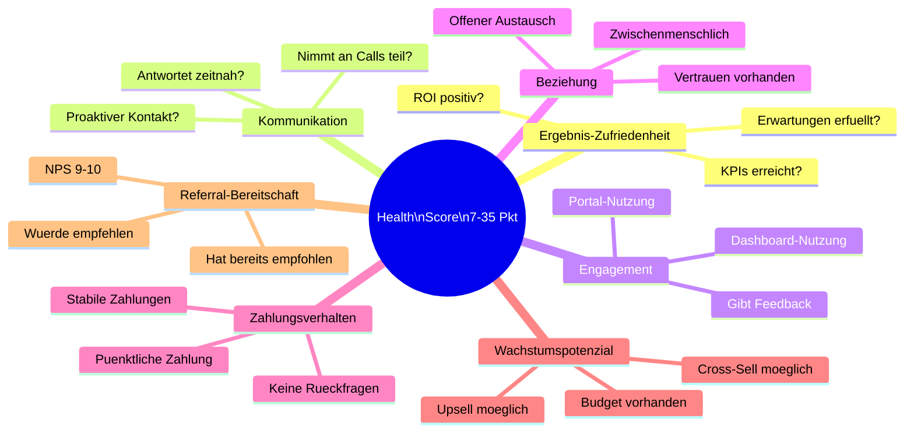
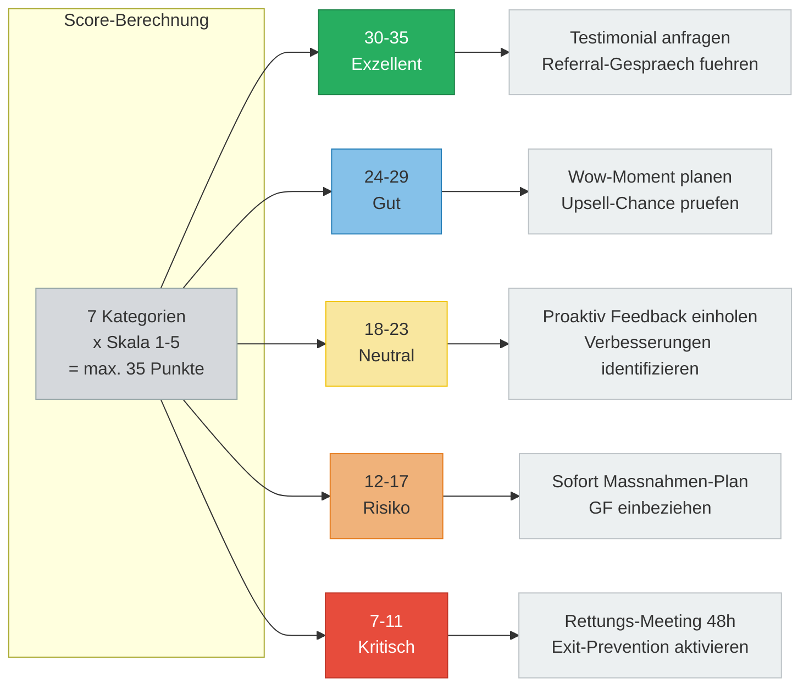

# Health Scorecard Dashboard

> 7 Bewertungskategorien und Score-Zonen visuell dargestellt.
> Basierend auf: [vorlagen/client-health-scorecard.md](../vorlagen/client-health-scorecard.md)

---

## Diagramm 1: Die 7 Metriken

---

## Diagramm 2: Score-Zonen und Aktionen

---

## Legende

### Score-Skala pro Kategorie

| Score | Bedeutung |
|---|---|
| **1** | Kritisch -- sofort handeln |
| **2** | Schlecht -- Verbesserungsplan noetig |
| **3** | Neutral -- beobachten |
| **4** | Gut -- halten |
| **5** | Exzellent -- Testimonial/Referral-Chance |

### Score-Zonen Farbkodierung

| Zone | Score | Farbe | Aktion |
|---|---|---|---|
| Exzellent | 30-35 | Gruen | Testimonial + Referral |
| Gut | 24-29 | Blau | Wow-Moment + Upsell |
| Neutral | 18-23 | Gelb | Feedback + Verbesserung |
| Risiko | 12-17 | Orange | Massnahmen-Plan + GF |
| Kritisch | 7-11 | Rot | Rettungs-Meeting 48h |

### Bewertungsfrequenz

- Monatliche Aktualisierung durch Account Manager
- Quartalsweiser interner Portfolio-Review aller Kunden
- Sofortige Neubewertung bei Warnsignalen

---

## Verknuepfte Dokumente

- [vorlagen/client-health-scorecard.md](../vorlagen/client-health-scorecard.md) -- Vollstaendige Scorecard-Vorlage
- [diagramme/04-churn-warning-entscheidungsbaum.md](04-churn-warning-entscheidungsbaum.md) -- Was tun bei Risiko/Kritisch
- [diagramme/05-tier-progression.md](05-tier-progression.md) -- Stufen-System fuer Exzellent-Kunden
